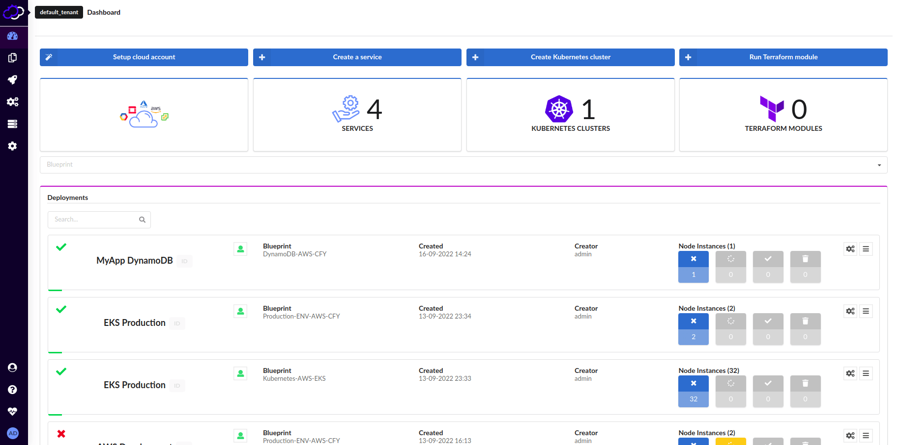

# Cloudify Console 
[](https://circleci.com/gh/cloudify-cosmo/cloudify-stage)
[](https://cypress.io)

The Cloudify Console provides User Interface for managing and analyzing [Cloudify Manager](https://cloudify.co).



## Requirements

The following requirements should be met prior starting the application:

- [Node.js](https://nodejs.org) (version >= 12.16.x) installed
    - With [NVM](https://github.com/nvm-sh/nvm) installed just execute `nvm use` to set proper version of Node.js
- [PostgreSQL](https://www.postgresql.org/) (version >= 9.5.x) installed and configured:
    - Make a database named `stage` 
    - Make a user named `cloudify` with `cloudify` as password
    - You can do this easily with docker:
        ```bash
        docker pull postgres
        docker run --name postgres-cfy -e POSTGRES_PASSWORD=cloudify -e POSTGRES_USER=cloudify -e POSTGRES_DB=stage -p 5432:5432 -d postgres
        ```
- [Cloudify Manager](https://cloudify.co/download) (version >= 5.x) accessible from your local machine

## Setup

To setup development environment and start the application follow the steps below.

1. **Configuration**
   
   * Create `conf/me.json` file basing on `conf/me.json.template`.
   * Change `<MANAGER_IP>` into real IP of your Cloudify Manager in that file.

1. **Dependencies installation**

   Run `npm run beforebuild` to install application dependencies.

1. **Database setup**
   
   Run `cd backend && npm run db-migrate` to initialize database.

1. **Application start**

   You can run the application by starting the stage backend server and starting [webpack dev server](https://webpack.js.org/configuration/dev-server/) serving client side:
   * In `backend` folder, run `npm run devStart` to start backend server   
     **NOTE**: you will need to have write permissions to `/var/log/cloudify/stage`). 
     For more information and troubleshooting visit [backend](./backend).
   
   * And also run `npm run devServer` to start webpack dev server.

At this point you should have development environment configured and running. Open [http://localhost:4000](http://localhost:4000) page in your web-browser to see if application is running.

Changes in the source code shall be loaded to the development version of the application: 
- for changes in [app](./app) and [widgets](./widgets) directory you need to reload page to see your updates,
- for changes in [backend](./backend) directory you don't need to reload page as backend server will automatically be restarted.

## Package

You can create application package and deploy it on a remote Cloudify Manager server.

### Package creation

You can create either tarball package or RPM package.

#### Tarball package

To create tarball package:  
1. Create production build by running: `npm run build`.
1. Pack all necessary files into archive by running: `npm run zip`. 
1. Application package will be in `stage.tar.gz` file in repository main directory.

#### RPM package

To create RPM package:  
1. Push branch with your changes to the remote.
1. Your RPM package will automatically be created by [CircleCI](https://circleci.com/gh/cloudify-cosmo/cloudify-stage) (check Artifacts tab on the `build-rpm` job).

### Package upload

To upload the package to the remote Cloudify Manager:
1. Copy private SSH key to access Cloudify Manager to `~/.ssh/cloudify.key` or explicitly define path to it: `export SSH_KEY_PATH=<PATH>`.
1. Define Cloudify Manager IP address by specifying `manager.ip` in `conf/me.json` or by exporting environment variable: `export MANAGER_IP=<MANAGER_IP>`.
1. Make sure tarball package (`stage.tar.gz`) is built or explicitly define path to the tarball or RPM package: `export STAGE_PACKAGE=<PATH>`.
1. Run uploading script: `npm run upload`.
1. Open browser and go to page `http://<MANAGER_IP>` to see if application is running.

### Package content

#### Tarball package

Package tarball archive contains the following resources:

* `backend` - Stage Backend - whole [backend](./backend) folder
* `conf` - configuration files (see [Configuration](./conf/README.md) for details)
* `dist` - Stage Frontend - directory created by Webpack according to the [production configuration](./webpack.config.js)
  * `appData` - built-in application data
    * `tours` - built-in tours - whole [tours](./tours) folder
    * `widgets` - built-in widgets
      * `<widget-name>` - every widget has its own folder 
        * `widget.js` - minified widget bundle file (+ gzip-compressed widget bundles)
        * `widget.js.gz` - (optional) gzip-compressed `widget.js`
        * `README.md` - documentation file
        * `widget.png` - widget thumbnail
      * ...
    * `templates` - built-in templates - whole [templates](./templates) folder
      * `pages` - built-in pages - whole [templates/pages](./templates/pages) folder 
  * `static` - static files
    * `images` - image files
    * `fonts` - font files
    * `js` - JavaScript bundles
      * `main.bundle.js` - bundle created from client-side application source code (+ gzip-compressed bundle)
      * `main.bundle.js` - gzip-compressed `main.bundle.js`
      * `vendor.bundle.js` - bundle created from client-side application external dependencies
      * `vendor.bundle.js.gz` - gzip-compressed `vendor.bundle.js`
    * `index.html` - main HTML file (created from [app/index.tmpl.html](./app/index.tmpl.html))
  * `userData` - user application data (empty in clean package)
    * `widgets` - custom widgets (empty in clean package)
    * `templates` - custom templates (empty in clean package)
      * `pages` - custom pages (empty in clean package)

#### RPM package

RPM package has all the files present in tarball package. In addition all files from [packaging/files](./packaging/files) directory are installed. 

## Tests

Go to [test/README.md](./test/README.md).

## Documentation 

1. Source Code documentation
   * [Frontend](./app/README.md) - client-side of the application
   * [Backend](./backend/README.md) - servers-side of the application
   * [Widgets](./widgets/README.md) - widgets documentation
   
2. Documentation way-of-work
   
   See [this](./doc/README.md) to learn how this project is documented.

## Support

To get community support join [Cloudify Community Slack](https://cloudify.co/slack/). 
aaa
aaa
aaa
aaa
aaa
aaa
aaa
aaa
aaa
aaa
aaa
aaa
aaa
aaa
