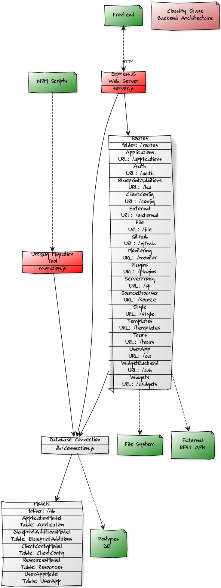

# Backend

## Starting

### Production

In production stage backend server is started in clusterm mode using [PM2 Runtime](https://pm2.io/runtime/) tool by `npm run start` script. Depending on value of `STAGE_BACKEND_INSTANCES` environmental variable value it starts on different number of vCPUs (0 for all). 

### Development

For a development puropses you can start backend in different modes using the following scripts:
* `npm run devStart` - multi-instance development mode
* `npm run prodStart` - multi-instance production mode in local environment - without Nginx web-server (it requires application build in `dist` folder to be in place - run `npm run build` in main folder to create it)
* `npm run devTrace` - single-instance development mode with stack traces for process warnings 
* `npm run devDebug` - single-instance development mode with inspector started (see [Debugging guide](https://nodejs.org/en/docs/guides/debugging-getting-started/) for details)

## Stopping

You need to be aware that to stop stage backend server running in cluster mode you need to kill process manager.
You can do that using `npm run stop` np script.
